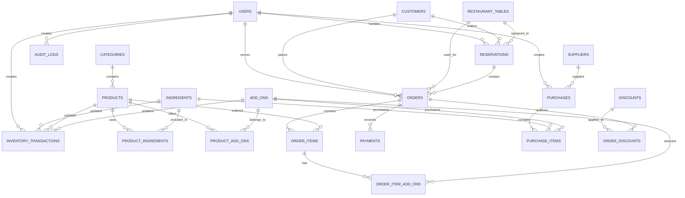

# UBSYNCSERVE Complete ERD

## Business Tables

### 1. users

| Column | Type | Key | Description |
|---|---|---|---|
| id | BIGINT | PK | User ID |
| name | VARCHAR(255) |  | User name |
| email | VARCHAR(255) | UNIQUE | Login email |
| password | VARCHAR(255) |  | Hashed password |
| role | ENUM |  | manager, waiter, admin |
| email_verified_at | TIMESTAMP | NULL | Email verification date |
| remember_token | VARCHAR(100) | NULL | Login remember token |
| created_at | TIMESTAMP |  | Creation date |
| updated_at | TIMESTAMP |  | Update date |

### 2. customers

| Column | Type | Key | Description |
|---|---|---|---|
| id | BIGINT | PK | Customer ID |
| name | VARCHAR(255) |  | Customer name |
| email | VARCHAR(255) |  | Customer email |
| phone | VARCHAR(30) | NULL | Contact number |
| address | TEXT | NULL | Customer address |
| created_at | TIMESTAMP |  | Creation date |
| updated_at | TIMESTAMP |  | Update date |

### 3. restaurant_tables

| Column | Type | Key | Description |
|---|---|---|---|
| id | BIGINT | PK | Table ID |
| table_number | INT | UNIQUE | Restaurant table number |
| capacity | INT |  | Maximum guests |
| status | ENUM |  | available, occupied, reserved, maintenance |
| created_at | TIMESTAMP |  | Creation date |
| updated_at | TIMESTAMP |  | Update date |

### 4. reservations

| Column | Type | Key | Description |
|---|---|---|---|
| id | BIGINT | PK | Reservation ID |
| customer_id | BIGINT | FK | References customers.id |
| table_id | BIGINT | FK, NULL | References restaurant_tables.id |
| handled_by | BIGINT | FK, NULL | References users.id |
| reservation_type | ENUM |  | advance_order, regular_booking |
| reservation_date | DATE |  | Reserved date |
| reservation_time | TIME |  | Reserved time |
| guest_count | INT |  | Number of guests |
| status | ENUM |  | pending, confirmed, cancelled, completed, no_show |
| notes | TEXT | NULL | Special requests |
| created_at | TIMESTAMP |  | Creation date |
| updated_at | TIMESTAMP |  | Update date |

### 5. reservation_tables

| Column | Type | Key | Description |
|---|---|---|---|
| id | BIGINT | PK | Record ID |
| reservation_id | BIGINT | FK | References reservations.id |
| table_id | BIGINT | FK | References restaurant_tables.id |
| created_at | TIMESTAMP |  | Creation date |
| updated_at | TIMESTAMP |  | Update date |

> Use this table only when one reservation can include multiple restaurant tables. If one reservation has only one table, table_id in reservations is sufficient.

### 6. categories

| Column | Type | Key | Description |
|---|---|---|---|
| id | BIGINT | PK | Category ID |
| name | VARCHAR(255) |  | Category name |
| description | TEXT | NULL | Category description |
| status | BOOLEAN |  | Active or inactive |
| created_at | TIMESTAMP |  | Creation date |
| updated_at | TIMESTAMP |  | Update date |

### 7. products

| Column | Type | Key | Description |
|---|---|---|---|
| id | BIGINT | PK | Product ID |
| category_id | BIGINT | FK | References categories.id |
| name | VARCHAR(255) |  | Product name |
| description | TEXT | NULL | Product description |
| cost_price | DECIMAL(10,2) |  | Product cost |
| selling_price | DECIMAL(10,2) |  | Customer price |
| image | VARCHAR(255) | NULL | Image path |
| stock_quantity | INT |  | Available stock |
| status | ENUM |  | available, sold_out, inactive |
| created_at | TIMESTAMP |  | Creation date |
| updated_at | TIMESTAMP |  | Update date |

### 8. add_ons

| Column | Type | Key | Description |
|---|---|---|---|
| id | BIGINT | PK | Add-on ID |
| name | VARCHAR(255) |  | Add-on name |
| description | TEXT | NULL | Add-on description |
| price | DECIMAL(10,2) |  | Add-on price |
| stock_quantity | INT |  | Available stock |
| status | BOOLEAN |  | Active or inactive |
| created_at | TIMESTAMP |  | Creation date |
| updated_at | TIMESTAMP |  | Update date |

### 9. product_add_ons

| Column | Type | Key | Description |
|---|---|---|---|
| id | BIGINT | PK | Record ID |
| product_id | BIGINT | FK | References products.id |
| add_on_id | BIGINT | FK | References add_ons.id |
| created_at | TIMESTAMP |  | Creation date |
| updated_at | TIMESTAMP |  | Update date |

### 10. ingredients

| Column | Type | Key | Description |
|---|---|---|---|
| id | BIGINT | PK | Ingredient ID |
| name | VARCHAR(255) |  | Ingredient name |
| unit | VARCHAR(50) |  | grams, pieces, liters |
| stock_quantity | DECIMAL(10,2) |  | Current stock |
| reorder_level | DECIMAL(10,2) |  | Minimum stock |
| status | BOOLEAN |  | Active or inactive |
| created_at | TIMESTAMP |  | Creation date |
| updated_at | TIMESTAMP |  | Update date |

### 11. product_ingredients

| Column | Type | Key | Description |
|---|---|---|---|
| id | BIGINT | PK | Record ID |
| product_id | BIGINT | FK | References products.id |
| ingredient_id | BIGINT | FK | References ingredients.id |
| quantity_required | DECIMAL(10,2) |  | Ingredient quantity per product |
| created_at | TIMESTAMP |  | Creation date |
| updated_at | TIMESTAMP |  | Update date |

### 12. orders

| Column | Type | Key | Description |
|---|---|---|---|
| id | BIGINT | PK | Order ID |
| customer_id | BIGINT | FK, NULL | References customers.id |
| table_id | BIGINT | FK, NULL | References restaurant_tables.id |
| reservation_id | BIGINT | FK, NULL | References reservations.id |
| served_by | BIGINT | FK, NULL | References users.id |
| order_type | ENUM |  | dine_in, walk_in, advance_order, take_out |
| status | ENUM |  | pending, preparing, ready, served, completed, cancelled |
| subtotal | DECIMAL(10,2) |  | Order subtotal |
| discount | DECIMAL(10,2) |  | Discount amount |
| tax | DECIMAL(10,2) |  | Tax amount |
| total_amount | DECIMAL(10,2) |  | Final amount |
| ordered_at | TIMESTAMP |  | Order date |
| completed_at | TIMESTAMP | NULL | Completion date |
| created_at | TIMESTAMP |  | Creation date |
| updated_at | TIMESTAMP |  | Update date |

### 13. order_items

| Column | Type | Key | Description |
|---|---|---|---|
| id | BIGINT | PK | Order item ID |
| order_id | BIGINT | FK | References orders.id |
| product_id | BIGINT | FK | References products.id |
| quantity | INT |  | Product quantity |
| unit_price | DECIMAL(10,2) |  | Price at time of order |
| subtotal | DECIMAL(10,2) |  | Quantity multiplied by price |
| special_instructions | TEXT | NULL | Customer instructions |
| created_at | TIMESTAMP |  | Creation date |
| updated_at | TIMESTAMP |  | Update date |

### 14. order_item_add_ons

| Column | Type | Key | Description |
|---|---|---|---|
| id | BIGINT | PK | Record ID |
| order_item_id | BIGINT | FK | References order_items.id |
| add_on_id | BIGINT | FK | References add_ons.id |
| quantity | INT |  | Add-on quantity |
| unit_price | DECIMAL(10,2) |  | Add-on price at order time |
| subtotal | DECIMAL(10,2) |  | Add-on subtotal |
| created_at | TIMESTAMP |  | Creation date |
| updated_at | TIMESTAMP |  | Update date |

### 15. payments

| Column | Type | Key | Description |
|---|---|---|---|
| id | BIGINT | PK | Payment ID |
| order_id | BIGINT | FK | References orders.id |
| amount | DECIMAL(10,2) |  | Amount paid |
| payment_method | ENUM |  | cash, gcash, card, bank_transfer |
| reference_number | VARCHAR(255) | NULL | Payment reference |
| status | ENUM |  | pending, paid, failed, refunded |
| paid_at | TIMESTAMP | NULL | Payment date |
| created_at | TIMESTAMP |  | Creation date |
| updated_at | TIMESTAMP |  | Update date |

### 16. inventory_transactions

| Column | Type | Key | Description |
|---|---|---|---|
| id | BIGINT | PK | Transaction ID |
| ingredient_id | BIGINT | FK, NULL | References ingredients.id |
| product_id | BIGINT | FK, NULL | References products.id |
| add_on_id | BIGINT | FK, NULL | References add_ons.id |
| user_id | BIGINT | FK | References users.id |
| transaction_type | ENUM |  | stock_in, stock_out, adjustment, damaged |
| quantity | DECIMAL(10,2) |  | Quantity changed |
| reason | TEXT | NULL | Transaction reason |
| created_at | TIMESTAMP |  | Creation date |
| updated_at | TIMESTAMP |  | Update date |

### 17. suppliers

| Column | Type | Key | Description |
|---|---|---|---|
| id | BIGINT | PK | Supplier ID |
| name | VARCHAR(255) |  | Supplier name |
| contact_person | VARCHAR(255) | NULL | Contact person |
| email | VARCHAR(255) | NULL | Supplier email |
| phone | VARCHAR(30) | NULL | Supplier phone |
| address | TEXT | NULL | Supplier address |
| status | BOOLEAN |  | Active or inactive |
| created_at | TIMESTAMP |  | Creation date |
| updated_at | TIMESTAMP |  | Update date |

### 18. purchases

| Column | Type | Key | Description |
|---|---|---|---|
| id | BIGINT | PK | Purchase ID |
| supplier_id | BIGINT | FK | References suppliers.id |
| purchased_by | BIGINT | FK | References users.id |
| purchase_date | DATE |  | Purchase date |
| total_amount | DECIMAL(10,2) |  | Total purchase cost |
| status | ENUM |  | pending, received, cancelled |
| created_at | TIMESTAMP |  | Creation date |
| updated_at | TIMESTAMP |  | Update date |

### 19. purchase_items

| Column | Type | Key | Description |
|---|---|---|---|
| id | BIGINT | PK | Purchase item ID |
| purchase_id | BIGINT | FK | References purchases.id |
| ingredient_id | BIGINT | FK, NULL | References ingredients.id |
| add_on_id | BIGINT | FK, NULL | References add_ons.id |
| quantity | DECIMAL(10,2) |  | Purchased quantity |
| unit_cost | DECIMAL(10,2) |  | Cost per unit |
| subtotal | DECIMAL(10,2) |  | Item subtotal |
| created_at | TIMESTAMP |  | Creation date |
| updated_at | TIMESTAMP |  | Update date |

### 20. discounts

| Column | Type | Key | Description |
|---|---|---|---|
| id | BIGINT | PK | Discount ID |
| name | VARCHAR(255) |  | Discount name |
| code | VARCHAR(100) | UNIQUE, NULL | Discount code |
| discount_type | ENUM |  | percentage, fixed_amount |
| discount_value | DECIMAL(10,2) |  | Discount value |
| minimum_order | DECIMAL(10,2) | NULL | Minimum order amount |
| start_date | DATE | NULL | Start date |
| end_date | DATE | NULL | End date |
| status | BOOLEAN |  | Active or inactive |
| created_at | TIMESTAMP |  | Creation date |
| updated_at | TIMESTAMP |  | Update date |

### 21. order_discounts

| Column | Type | Key | Description |
|---|---|---|---|
| id | BIGINT | PK | Record ID |
| order_id | BIGINT | FK | References orders.id |
| discount_id | BIGINT | FK | References discounts.id |
| discount_amount | DECIMAL(10,2) |  | Applied discount |
| created_at | TIMESTAMP |  | Creation date |
| updated_at | TIMESTAMP |  | Update date |

### 22. audit_logs

| Column | Type | Key | Description |
|---|---|---|---|
| id | BIGINT | PK | Log ID |
| user_id | BIGINT | FK, NULL | References users.id |
| action | VARCHAR(255) |  | Action performed |
| table_name | VARCHAR(255) |  | Affected table |
| record_id | BIGINT |  | Affected record ID |
| old_values | JSON | NULL | Previous values |
| new_values | JSON | NULL | New values |
| created_at | TIMESTAMP |  | Log date |

## ERD Diagram

## Relationship Summary

| Relationship | Cardinality |
|---|---|
| users to reservations | One-to-many |
| users to orders | One-to-many |
| customers to reservations | One-to-many |
| customers to orders | One-to-many |
| restaurant_tables to reservations | One-to-many |
| restaurant_tables to orders | One-to-many |
| categories to products | One-to-many |
| products to ingredients | Many-to-many through product_ingredients |
| products to add_ons | Many-to-many through product_add_ons |
| orders to order_items | One-to-many |
| products to order_items | One-to-many |
| order_items to add_ons | Many-to-many through order_item_add_ons |
| orders to payments | One-to-many |
| suppliers to purchases | One-to-many |
| purchases to purchase_items | One-to-many |
| orders to discounts | Many-to-many through order_discounts |

## Laravel System Tables

These tables are technical Laravel tables and may be placed in a separate ERD section:

| Table | Primary Key | Purpose |
|---|---|---|
| password_reset_tokens | email | Password reset functionality |
| sessions | id | User sessions |
| cache | key | Application cache |
| cache_locks | key | Cache locking |
| jobs | id | Queued jobs |
| job_batches | id | Job batches |
| failed_jobs | id | Failed queued jobs |
